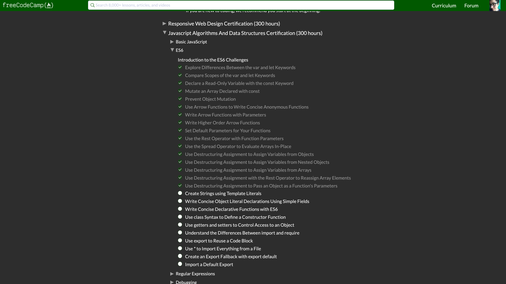
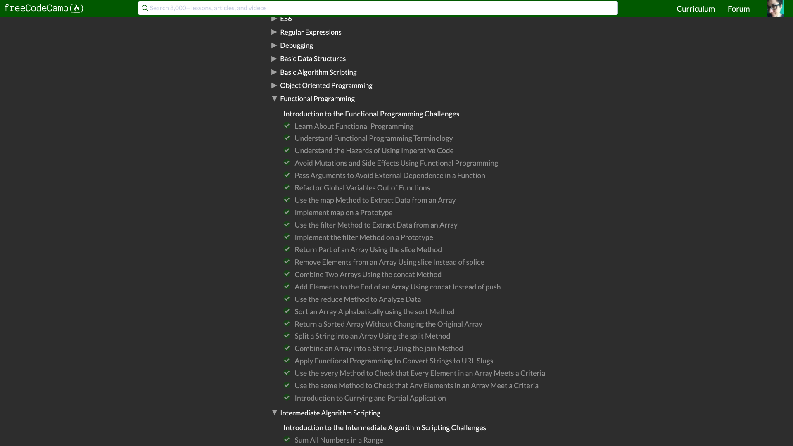
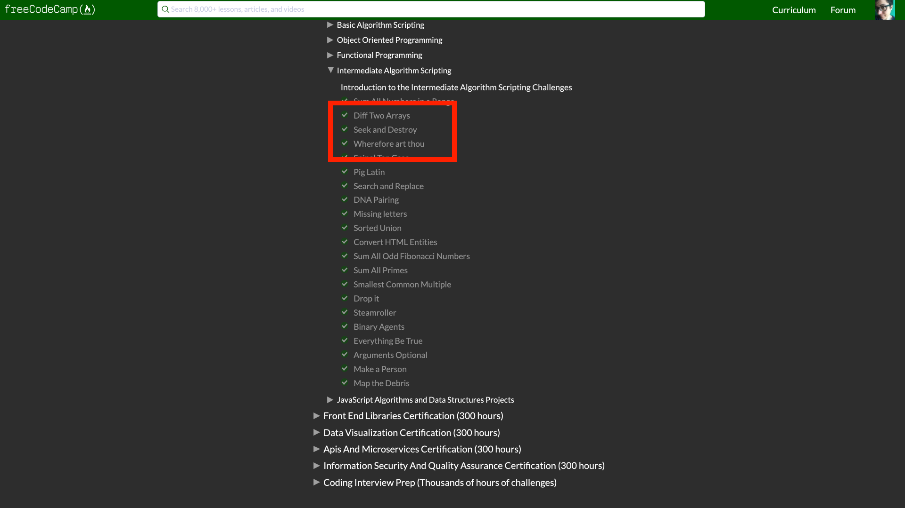
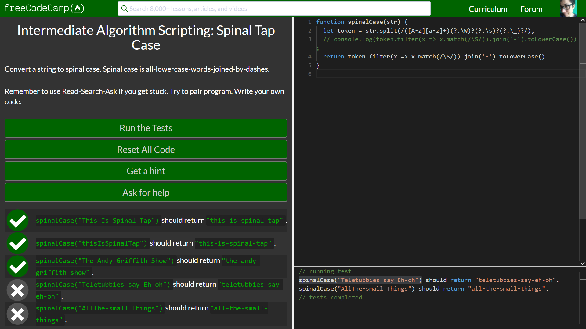
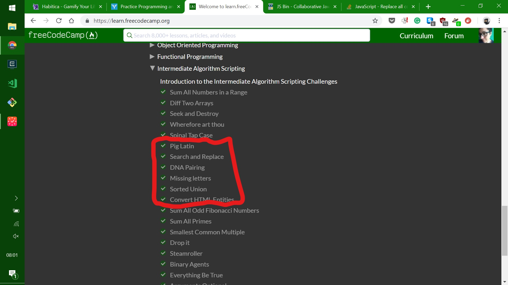
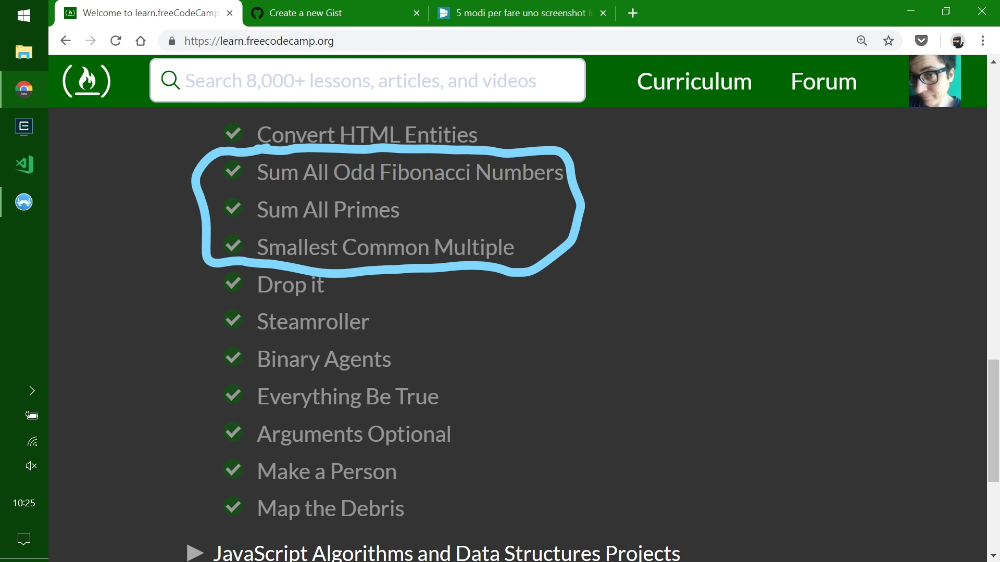
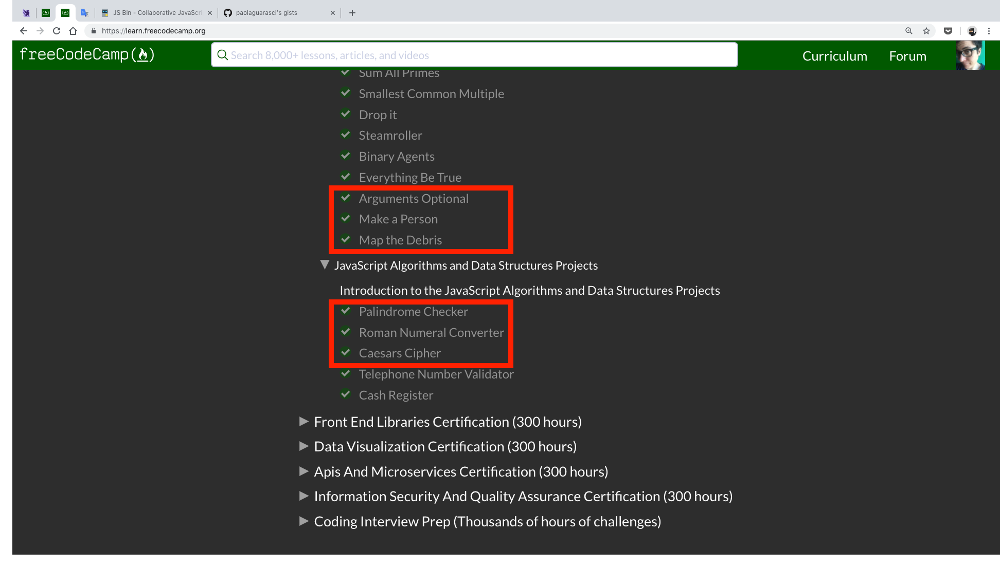
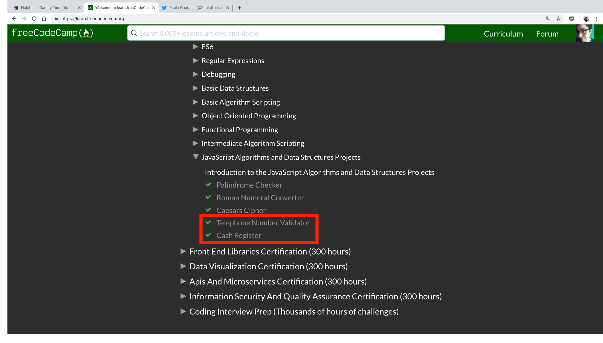
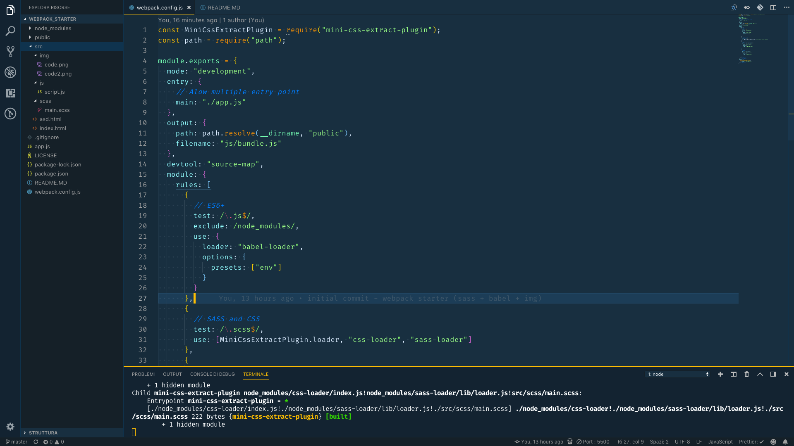

# #100DaysOfCode Log - Round 1 - Paola Guarasci

The log of my #100DaysOfCode challenge. Started on 21 May 2018

## Log

This is my first round with this challenge!

### R1D1

I start whit beta path on freeCodeCamp RWB. Just for review the basic!

### R1D2
I just found out about beta.freecodecamp.org there is no trace of my progress yesterday!
~~Obviously, it's in beta yet!~~
~~I continue with the review, anyway: _CSS and JS basic_.~~
I have switch to stable curriculum.
Continue my last run:
-4 challenge to claim the front end certificate.

### R1D3

**I'm stuck on minimax algorithm.** I need it for one of the last challenges on my
path, "Tic Tac Toe". I'm tried doing this in C++ first because my JS is little confusing at the moment.
In fact, i decided to review my JS knowledge.

### R1D4

## **Minimax** at 35% done. It's a long way -.-''''

_Stop for exam!_

---

# Restart!

The log of my #100DaysOfCode challenge. Started on 25-07-2018

### Day 001-008

I learned a little bit of E6, OOP, RegEx, Algorithm ad Functional Programming. From today i will update this repo every day!

### Day 009

Three medium-level algorithms in JS.

### Day 010

_Stuck with *Intermediate Algorithm Scripting: Spinal Tap Case*._
**Edit:** Done! _(late, in evening)_

### Day 011

6 Algorithm in 1,5hours. Well Done!

### Day 012

No good day: only 3 algorithm in 2hours :/

---

**I'm back, my last update is committed 12 days ago.
I know, I broke one of the rules of the game. But It's my first time, the next one will be better.**

---

### Day 013

I'm working with the intermediate algorithms (JS path on Free Code Camp). It's almost done, so I'm planning the rest of the days [-87]

### Day 014

I'm finish the path of FCC - JS Curriculum. Yeah!!!!

### Day 015

I'm work on my own webpack starterkit with sass and ES6
[repo](https://github.com/paolaguarasci/webpackStarter)

