# #100DaysOfCode Log - Round 1 - Paola Guarasci

The log of my #100DaysOfCode challenge. Started on 21 May 2018

## Log

This is my first round with this challenge!

### R1D1

I start whit beta path on freeCodeCamp RWB. Just for review the basic!

### R1D2
I just found out about beta.freecodecamp.org there is no trace of my progress yesterday!
~~Obviously, it's in beta yet!~~
~~I continue with the review, anyway: _CSS and JS basic_.~~
I have switch to stable curriculum.
Continue my last run:
-4 challenge to claim the front end certificate.

### R1D3

**I'm stuck on minimax algorithm.** I need it for one of the last challenges on my
path, "Tic Tac Toe". I'm tried doing this in C++ first because my JS is little confusing at the moment.
In fact, i decided to review my JS knowledge.

### R1D4

## **Minimax** at 35% done. It's a long way -.-''''

_Stop for exam!_

---

# Restart!

The log of my #100DaysOfCode challenge. Started on 25-07-2018

### Day 001-008

I learned a little bit of E6, OOP, RegEx, Algorithm ad Functional Programming. From today i will update this repo every day!

### Day 009

Three medium-level algorithms in JS.

### Day 010

_Stuck with *Intermediate Algorithm Scripting: Spinal Tap Case*._
**Edit:** Done! _(late, in evening)_

### Day 011

6 Algorithm in 1,5hours. Well Done!

### Day 012

No good day: only 3 algorithm in 2hours :/

---

**I'm back, my last update is committed 12 days ago.
I know, I broke one of the rules of the game. But It's my first time, the next one will be better.**

---

### Day 013

I'm working with the intermediate algorithms (JS path on Free Code Camp). It's almost done, so I'm planning the rest of the days [-87]

### Day 014

I'm finish the path of FCC - JS Curriculum. Yeah!!!!

### Day 015

I'm work on my own webpack starterkit with sass and ES6
[repo](https://github.com/paolaguarasci/webpackStarter)

### Day 016

I'm work on my portfolio, based on webpack starterkit, and i find a issue with fontawesome. So i try to solve this problem and pull request to original repo of npm package. I hope it's merge
[myMod](https://github.com/paolaguarasci/font-awesome-loader/tree/wp4-fa5) 🤞

👏👏👏👏 **This screen about my first contrib on learn repo** 👏👏👏👏

### Day 017

I'm find a better way to work with wp4 and fa5. This is the medium [article](https://medium.com/@paolaguarasci/how-use-font-awesome-5-scss-and-web-pack-4-904048eec0a1) that I wrote for explane how to work.

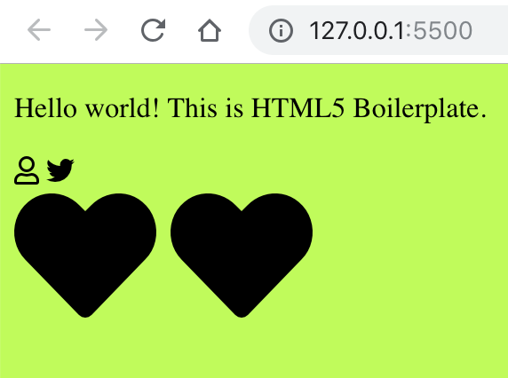

### Day 018

I'm work on my portfolio, following [Traversy Media](https://www.youtube.com/playlist?list=PLillGF-RfqbYoGoCjKoMOkVznV6aSXKzU)

### Day 019

I'm work on my portfolio, following [Traversy Media](https://www.youtube.com/playlist?list=PLillGF-RfqbYoGoCjKoMOkVznV6aSXKzU), like yesterday, but now I'm almost done and the site is online on [surge.sh](surge.sh) ---> [Link](http://hushed-skirt.surge.sh/).
I'm correct some issue with mobile but a few still exist.

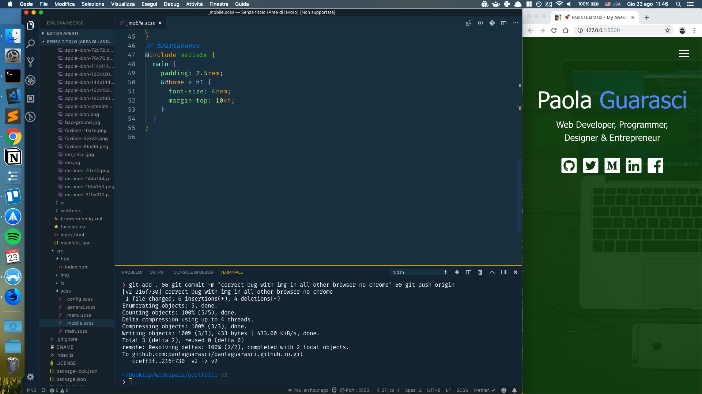

### Day 020

I'm finished my portfolio. Look awesome!
I switched from surge.sh to [firebase](https://myawesomeportfolio-f8ff8.firebaseapp.com) because its have https and password protetion for free.
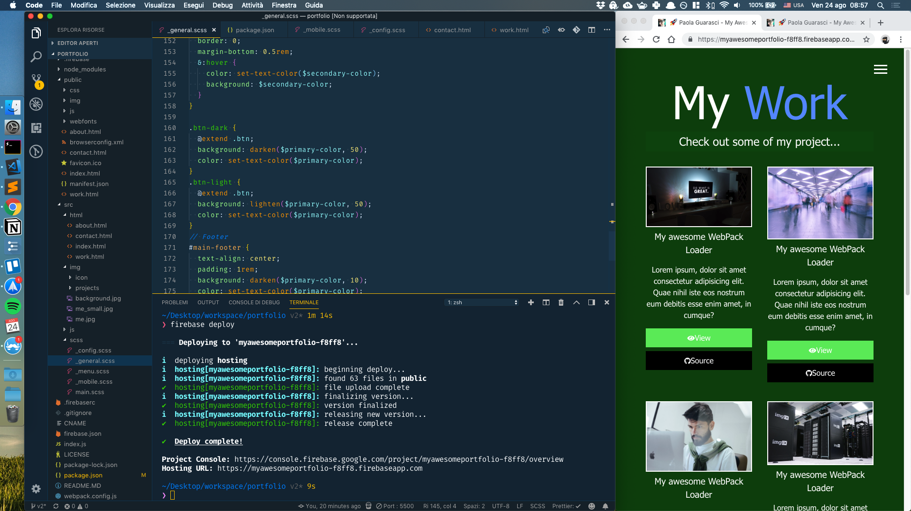

### Day 021

[i'm done this stuff yesterday but I forget to update repo and Twitter]
I'm on CSS Grid (Wes Bos) - I had started this yesterday in spare time, now I'm working on topic 07-12

### Day 022

I'm still on CSS Grid (WesBos) - Topic 13 - 18

### Day 023

Two CSSGRID challenges. The first (topic 19) quite easy and I did it all by myself, all right. The second (topic 20) a bit 'more complex: it involves other knowledge of CSS and a bit' of JS, I made it almost entirely alone, except for that part of CSS concerning the overlay ... All day to try to figure out how to create a two-div overlay that does not break the layout!
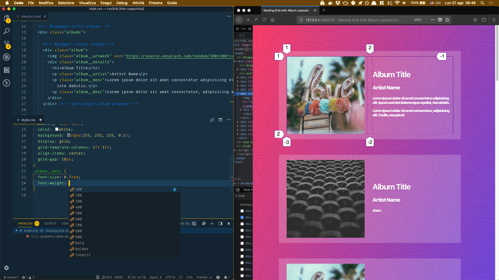

### Day 024

5 block of 45min + 15min

- restart with Gulp.JS
  - critical path
  - purifycss
  - imagemin
  - uglify
  - dep e mon manage
    - webpak stream
  - postcss

2 block of 45min + 15min to cssgrid

- 21 css vs flex [flip, autoflow column, flex 1, controllo pos singolo elemento, unknow dim or num of elements]

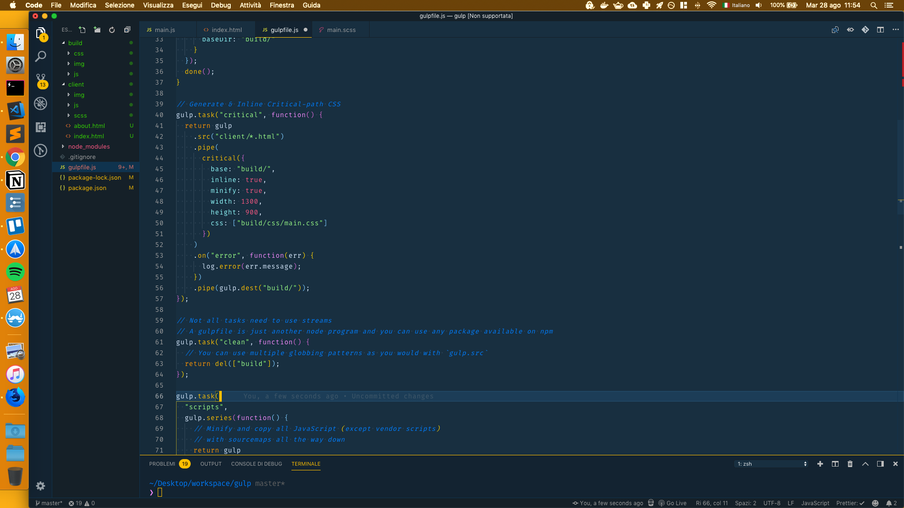

### Day025

I'm cloned CODEPEN! (the style...!); In the picture you can see my attempt. Disordered code, missing some details and different approach... but all in all I'm happy! 🔥

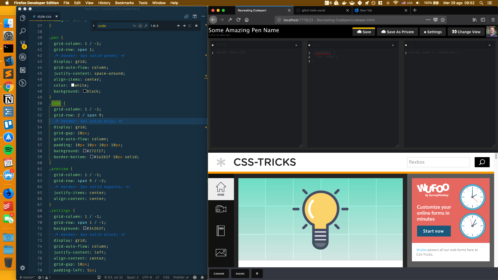

### Day 026

@wesbos took me away all morning, a very long lesson to try alone: a complete and responsive layout! In the video, he takes just under 30min. I have spent all morning. But I like my result, even #js , and the code I wrote is much cleaner.

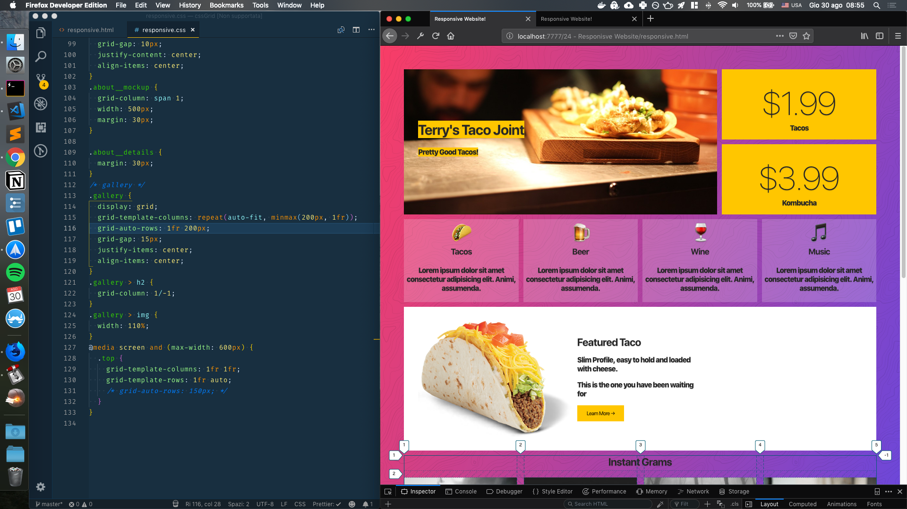

### Day 027 - [31/08/2018]
I'm finish CSSGrid Course and I'm planned the nest 13 days.
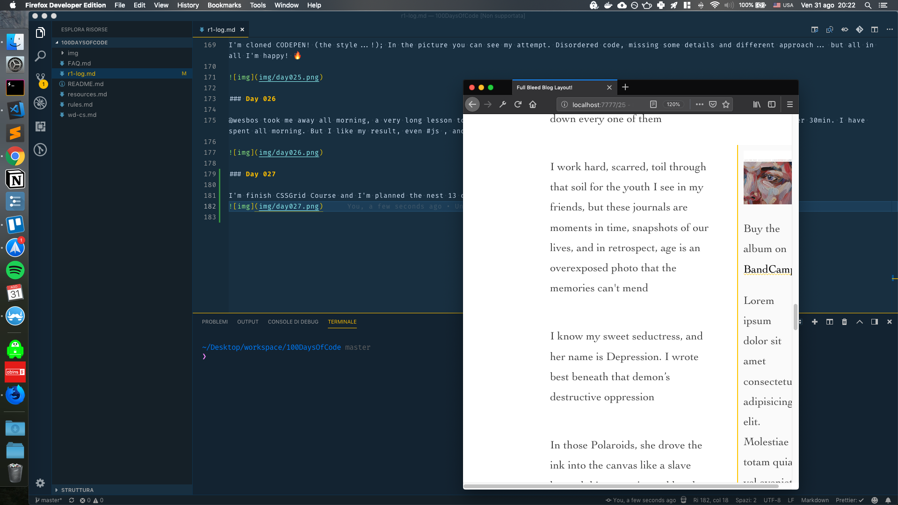

### Day 028 - 029 [01-02/09/2018]
I worked to ajax request: both vanilla js and fetch api, I re-learned so much: how to send aa request, how to parse json, how to dialogue with php.

### Day 030 - 031 - 032 [03-05/09/2018]
I work on my WP portfolio, I hate WordPress 😤

### Day 033 [06/09/2018]
today is a unity test day 🎉 and i founded i love it 😍

### Day 034 [07/09/2018]
Today I’m learned what are Continuous Integration and how config CircleCI 😎

### Day 035 [08/09/2018]
Blockchain day!!! Intro and some tutorial teoretical stuff!!

### Day 036 [09/09/2018]
Cloning ls command line tools in Node.js... looks pretty good! Take a look --> [repo](https://github.com/paolaguarasci/cmdClone) | And now I'm following this [roadmap](https://github.com/kamranahmedse/developer-roadmap)
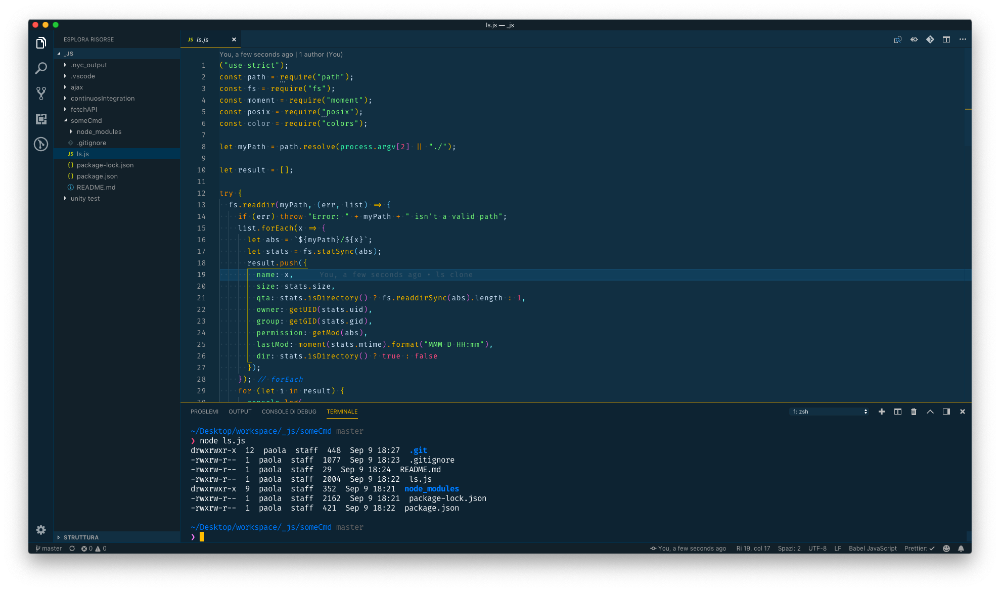

### Day 037 [10/09/2018]
Another clone of one tool: copy! Do its job pretty good! Take a look --> [repo](https://github.com/paolaguarasci/cmdClone)
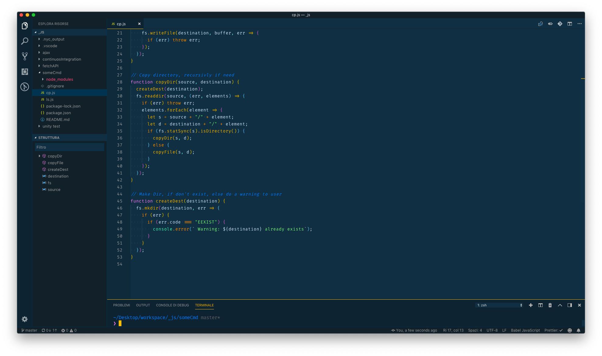

### Day 038 [11/09/2018]
I have spent all day working with Reddit API, so I had learned a little bit of OAuth2 dance and how to perform a request and handle resp.
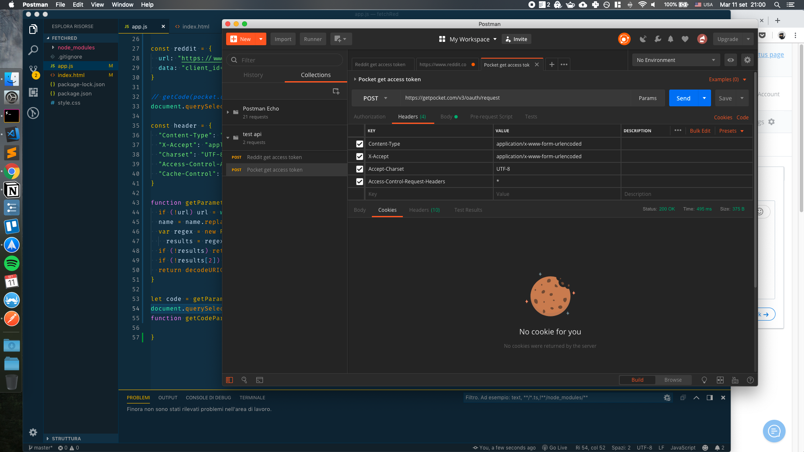

### Day 039 [12/09/2018]
I'm working on my path: today it's time to fetch and save (locally, for download) the latest 25 posts on /r/programmer 👾
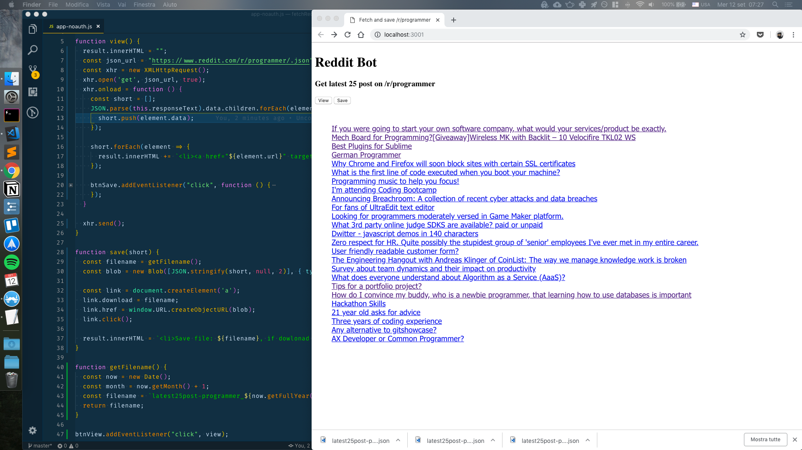

### Day 040-42 [13-15/09/2018]
I'm a little bit stressed in this days and I forget to update this repo, **but I'm worked every day** and I twitted my daily progress. So... What I have does at this period? I have cloned the **tree -j** command and created the inverse script, which creates the structure from the json. Today, however, I created a script in Node.js for searching files.

### Day 043 [16/09/2018]

bad day (I'm sick). I have done a little downloader for the images. work in the shell inserting the link of the page that contains the image of your choice

### Day 044-045 [17-18/09/2018]

I've started two projects: first, finished at 50%, the second is almost done. They are a pdf modifier and an automated mail sender. They are the repos:

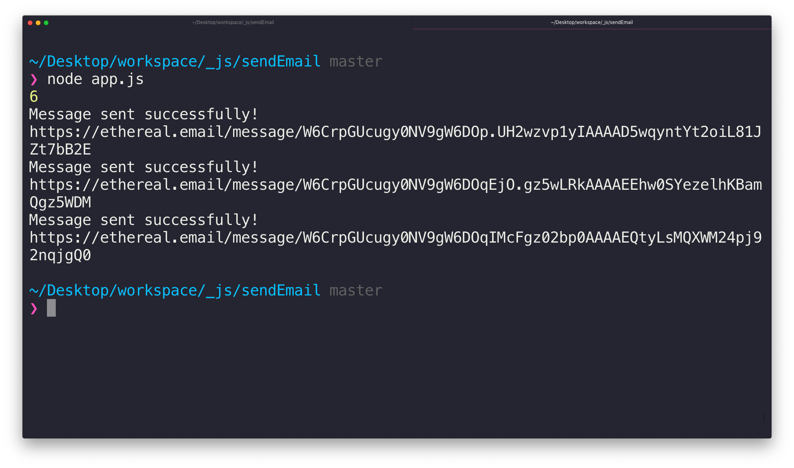

### Day 046 [19/09/2018]

My first npm package is out! Obviously, it's filled with bugs of all kind, but I'm happy!
Link: [npm](https://www.npmjs.com/package/tree2json)
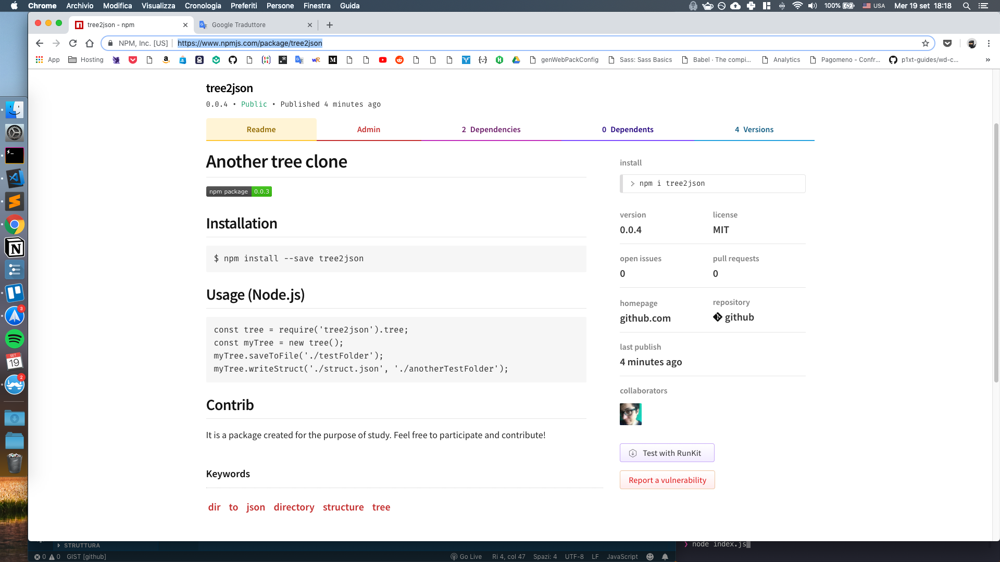

### Day 047 [20/09/2018]
It's time for my to contrib on an opensource project 🤓
I spent much of my time today to look around for some project no much obscure.

### Day 048 [21/09/2018]
A little step in my own big project: a console replica in the browser. I learned how to virtualize code and execute unsafe script in my app.

### Day 049 [22/09/2018]
OOP in JS: Object Oriented Programming in Javascript. Now I know about objects, value types, reference types, how to make a literal object, how to create an object with the constructor and with the factory function. The behaviour is almost like all other languages that support OOP, like C++ ma JS doesn't have the class, in a strict sense, but it uses prototype design.

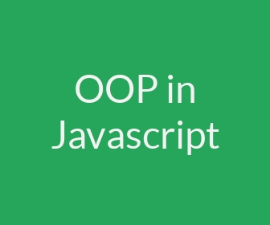

### Day 050 [23/09/2018]
I'm worked with flow control: async/await and promises. I'm excited about this side of JS, this dark side of JS. 😎

### Day 051 [24/09/2018]
I'm worked on try, catch, throw and other way to handle error.

### Day 052 [25/09/2018]
Today a little overview of design pattern (constructor pattern, model pattern, object creational pattern)

### Day 053 [26/09/2018]
Jest playground

### Day 054 [27/09/2018]
Intro in DB: a few SQL syntax.

### Day 055 [28/09/2018]
Intro in DB: a few SQL syntax.

### Day 056 [29/09/2018]
I'm starting my fist blog project. the main topic are crud operation on db and user login-registration. today i'm setup db using both command line and datagrip and setup project folder.

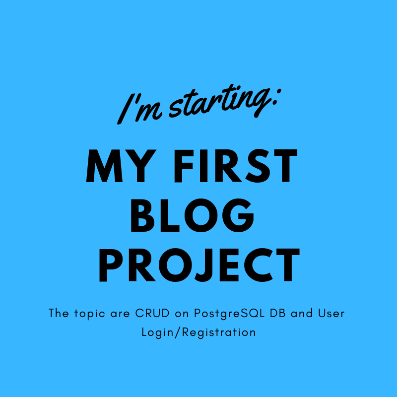

### Day 057 [30/09/2018]
Continue with crud operation: get ok, put ok.

### Day 058 [01/10/2018]
I'm working on my blog project. CRUD API works but without security policy. Tomorrow I will implement that.
